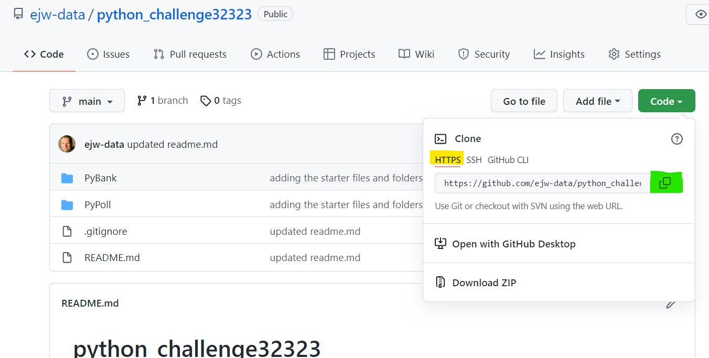
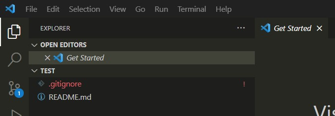

# GitHub  
Used for homework and projects and will become your portfolio  

> :arrow_lower_right: **Recent Updates:**  
>  *  Added two new details to `Create Repo and Clone` section:  
>      **Important Note:**  It is advised for `Mac` users to add `.DS_Store` to the `.gitignore` once it is cloned. Do this change from the local repo and `git add .` and `git commit` immedilately so that you don't forget.  
>      **Important Note:** After you have cloned your repo to your local machine, I would highly advise not adding any files through the online interface. This is often the cause of why a push fails - I have advice about how to correct the issue below - it's not really a problem but a common git procedure.    

<details>
<summary>Create Repo and Clone</summary>

1.  Make repo:
    *  Go to GitHub and click on the Cat logo in the upper left corner.  Find the Green button that says `New`
    *  On the Create a new repository page.  Fill in the repo name, give it a short description (can be changed later), select Public, select Add a README, select Add .gitignore, in the new dropdown select Python.
    * Click `Create repository`
1.  You should now see your new repo and it will only have an empty README.md file and a .gitignore file.  Lets add these to your desktop.
1.  Clone repo:  
    *  On the repo main page, click the green `Code` button.
    *  There are three link options (HTTPS, SSH, GithubCLI), make sure to click the SSH tab.  The link will then look like `git@github.com:<username>/<repo name>.git`.
    *  Copy the link and go to your desktop and right click and choose 'Git Bash Here' or 'Open terminal in Folder'.  
    *  In this terminal type, `git clone <paste link here>`.  This downloads a folder on your desktop that is linked to the online repo.
    *  **Important Note:**  It is advised for mac users to add `.DS_Store` to the `.gitignore` once it is cloned.  Do this change from the local repo and `git add .` and `git commit` immedilately so that you don't forget.
    *  **Important Note:** After you have cloned your repo to your local machine, I would highly advise not adding any files through the online interface.  It is a common problem when a push fails - advice about how to correct the issue is below.
</details>
<details>

<summary>Setup Files on Local Machine </summary>

1.  Open your repo folder on your desktop like you normally would.  Copy the homework files into this folder.
1.  Have your file structure inside your repos look like this for the python assignments unless otherwise requested in the homework instructions:  
```
      repo_name 
            |__ data/   
            |    |__ file_name.csv
            |
            |__ python_file.py or python_file.ipynb
            |__ README.md
            |__ .gitignore

```
</details>

<details>
<summary>Push Repo to GitHub</summary>

After you get your initial files added to your repo folder then you can update your online GitHub repo.
**`Any time you make some significant changes then you should do the following.`**  This is part of the documention process and part of the file backup process.  Every 'commit' saves a snapshot of your files.

1.  Navigate to the top level of your repo folder.
1.  The easiest way to do this is by right clicking on the repo folder.  If you are in the right location on your terminal then by typing `ls` should show you your folders and the README.md and .gitiginore file.  This inidcates you are inside your repo folder at the top level.  
1.  At this top level location do the following in terminal:  
    * `git status`
    * `git add .`
    * `git commit -m "what is being added/changed"`
    * `git push origin main`
1.  `git status` is used to see what changes are going to be made - what files need to be tracked, what changes have occurred, etc.
</details>

<details>

<summary>Submit Homework Link to BCS</summary>

1.  Only submit links from you personal `GitHub` account.  **DO NOT TRY TO SUBMIT A `GITLAB` LINK.**
1.  Go to your `GitHub repo` for the homework or project.
1.  In the upper right corner of the repo is a green button that says `Code`.  Click this button.
1.  Select `HTML` from the three tabs at the top of the new menu.
1.  Click the copy button for the link.  It should be in the format of `https://github.com/<username>/<repo_name>.git`
  
1.  Add this link to the submission location on the calendar that also shows when the homework is due.
</details>

<details>

<summary>Git Push Fails</summary>

Often the message will say something like:
  *  `! [rejected]      main --> main (non-fast-forward)`
  *  `! [rejected]      main --> main (fetch first)`

The message also usually says that there is a difference between the remote (github) and the local (your computer).  It also usually says that it suggests that you do a `git pull`.  Here is what happens after you do that:  

1.  Perform a `git pull origin main`
1.  The conflicting files will be pulled onto your local machine but your existing content will also be there.  May seem confusing but just wait...
1.  See the image below.  The error is near the top then I do a git pull and you can see the final message is `Automatic merge failed; fix conflicts and then commit the result.`. Notice the next line now says **`(main | merging)`**.
 
1.  Now if VSCode does not automatically come up then you need to do the following in terminal:  type `code .` to open the entire repo folder in VSCode.
1.  The sidebar will show the conflicts by highlighting the conflict files in `red` and with a `!`.  it will look like this:
 
1.  Open this file by clicking on it and read the conflicts.  Here is an example of what it looks like.  You will need to modify the file so it is in it's final form.  

1.  You can see the differences in the code are in `turquoise` and `blue`.  You can edit this part so the only the code is left and then remember to save.   Here is an example:

1.  Now got to terminal and perform the normal `git add .`, `git commit -m "message`.  You will notice the terminal output changes.

1.  After comitting the changes, the terminal will show `(main)`.
1.  You can do a `git push origin main` to get everything synchronized.  
<br>
</details>

<details>

<summary>Rename or Delete Repo</summary>

This is a non-recoverable process.  So only do this if you have a practice repo and are sure you want to get rid of it.  

1.  Go to your repo on GitHub
1.  There is a black menu bar at the top and under it is a gray menu bar that starts with `<Code>`, ....  Go to the menu option in the gray bar that says `Settings`.  
1.  To rename a repo, change the name in this location.
1.  At the bottom of the page in the `Danger Zone` section, there is a `Delete this repository` button.  Last warning, this can not be undone.
1.  Select `Delete` and follow the instructions.  
</details>
