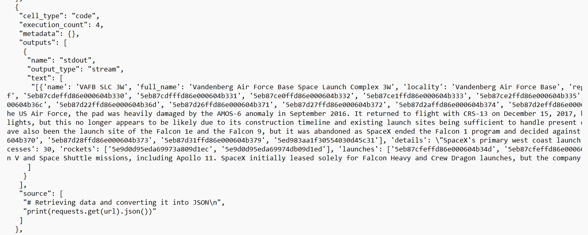

# Using Github with Jupyter Notebooks  

### When not collaborating with others...
Github has become much better at displaying Jupyter Notebooks online.  Before a couple years ago, you could not view the contents of a jupyter notebook through the online interface or if it did let you see a preview then the formatting was often incorrect.  Many of those issues have been fixed and people have forgotten about those days.  

When using Jupyter Notebooks for your own projects or sharing your books with others, it is not a problem to keep everything on Github.  This is because there is only one author and the tracking system is not concerned about what you do with your own files - **`assuming all changes occur in your local repo`**.  

    Many of you have probably seen what happens if you make changes to the online repo through the edit buttons and also make changes to your local repo - you get a merge conflict that needs fixed before you can push your local repo to Github.  When you make these changes, it's almost like you have two authors of the document and git doesn't know which document should be the `master copy`.  

## When collaborating with other...  

Now, lets say that you are going to work in a jupyter notebook and you are giving a friend access to also makes changes to that github repo.  This is very common and git will track the changes of everyone working on the document.  This is great!  It tracks each individual change and if we both make changes to the same line of code, then it will tell us through a `Merge Conflict` message and we can review the conflict and modify the code so git now has the new/modified version of the `master file`.  This resolves the merge conflict.  

>So why am I bringing up Jupyter Notebooks specifically?  

Jupyter Notebooks are text files that have the inputs and outputs stored in a format called `JSON`.  Essentially, the structure of the document is held in `JSON` and when we use Jupyter Notebooks it takes the input and processes it and then returns an output that has come custom details specific to that batch of calculations.  Here is an example of an input and output cell in JSON: 

  

Since the output of the cell has some custom info that will be different for when person A runs it and also different for when person B runs it, this causes the potential merge conflict when the documents are pushed to github.  There are two ways of fixing this `Merge Conflict`:  
1.  Review each conflict in its JSON format - displayed above - and correct the conflicts without accidently removing any brackets, quotes, or special characters needed to keep the `JSON` format.  This can be difficult and often pasting the JSON in a formatting tool like [JSON Validator](https://jsonformatter.curiousconcept.com/#) can let you know if you have made an error and broken the JSON format.  **I will post more about this the next time I cause this problem.  It is best explained by showing an example.**  
2.  In a Jupyter Notebook, **before** any `git add, commit or push` of a notebook that you have worked on, go to `Kernel` and `Select Clear Outputs`.  That is it.  The notebook will be saved with `output=[]` instead of `output=[lots and lots of text and some custom stuff]`.  Since the custom output parts are no longer being saved then there will not be a problem.  

People can still use your notebook.  They will just need to run your file first before they will see the outputs.  This is why it is important to have a nice READEME.md section that discusses how to setup/install your project.  